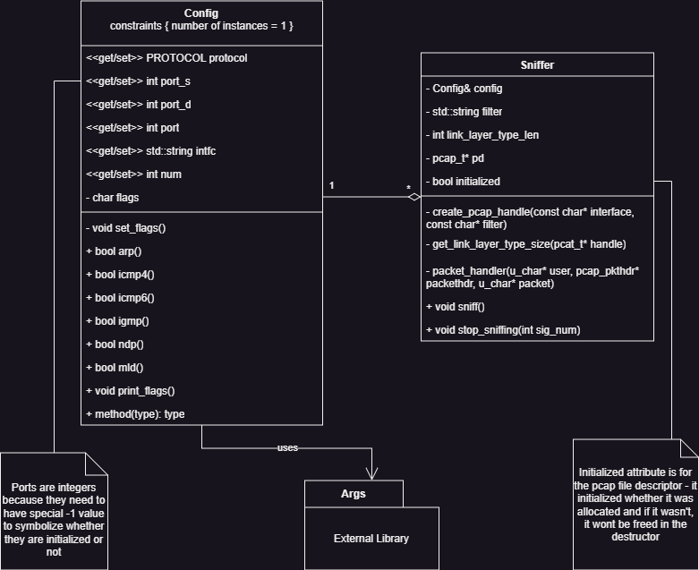
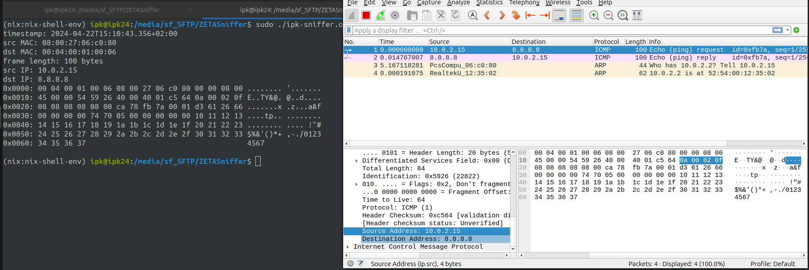
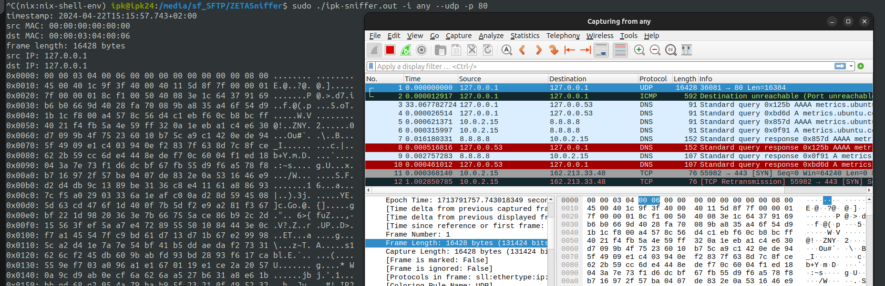

# ZETASniffer

A simple Linux packet sniffer built in C++ using the LIBPCAP library.

Author: Ondřej Hruboš (xhrubo01)

Gitea: [https://git.fit.vutbr.cz/xhrubo01/ZETASniffer](https://git.fit.vutbr.cz/xhrubo01/ZETASniffer)

[Changelog](CHANGELOG.md), [License](LICENSE)

## Usage

`./ipk-sniffer [-i interface | --interface interface] {-p|--port-source|--port-destination port [--tcp|-t] [--udp|-u]} [--arp] [--ndp] [--icmp4] [--icmp6] [--igmp] [--mld] {-n num}`

See `./ipk-sniffer --help` for more information about the program.

## Build

To build the program, the `libpcap`[^6] library is needed.
Pull or download this repository and then run:

`make`

## Documentation
The networking part was programmed in C++ using the LIBPCAP library[^3]. The program can display the UDP, TCP, ICMP4, ICMP6, NDP, IGMP, and MLD protocols.

Filters are built in the `Sniffer` constructor using a **BPF** filter expressions[^2], which are then passed to the `pcap_compile()` function.

Sources of information were pcap tutorials[^1] [^4] and other official resources[^3].

### Classes
- `conf::Config`
    - Singleton class for storing and parsing command line arguments.
    - Uses the external `args` library
    - The options `arp`, `ndp`, `icmp4`, `icmp6`, `igmp` and `mld` are stored in a single `char` value and are set as a bit flags. Their bit representation is defined in the `config.hpp` header

- `Sniffer`
    - Class which commences and ends the sniffing using the LIBPCAP library.
    - Contains `conf::Config` class to access the parsed arguments. The `conf::Config` class is passed to the instance as an argument.
    - Builds a BPF filter and stores it in the `filter` attribute.
    - Sniffing can be started by calling the `sniff()` function
    - The `static void stop_sniffing(int sig_num)` function is used to free all resources after `SIGTERM`, `SIGQUIT`, `SIGINT` events or after the program ends.

### Class diagram

## External libraries

- **args**[^5] - A single-header C++ library used to parse command line arguments. The library is the `args.hxx` file. Source: [Github repository](https://github.com/Taywee/args).

## Tests
All testing was done comparing the output of Wireshark with `ipk-sniffer`. Below are some examples of comparison between Wireshark and ipk-sniffer. 
Packets were simulated using the NetCat tool (`nc`).

1. Capturing packet from command `ping 8.8.8.8 -c 1`

2. Capturing packet from command `nc -u localhost 80 < /dev/random`

<!--- Resources --->
[^1]: *Hargrave, V. (2012, December 9). Develop a Packet Sniffer with Libpcap.* vichargrave.github.io. https://vichargrave.github.io/programming/develop-a-packet-sniffer-with-libpcap
[^2]: *BPF Packet Filtering Expressions — nProbe 10.1 documentation.* (n.d.). https://www.ntop.org/guides/nprobe/bpf_expressions.html
[^3]: *Programming with pcap | TCPDUMP & LIBPCAP.* (n.d.). https://www.tcpdump.org/pcap.html
[^4]: *libpcap packet capture tutorial.* (n.d.). http://yuba.stanford.edu/~casado/pcap/section3.html
[^5]: *Taywee/args*. A simple header-only C++ argument parser library. https://github.com/Taywee/args/tree/master
[^6]: *LIBPCAP*. https://www.tcpdump.org/
